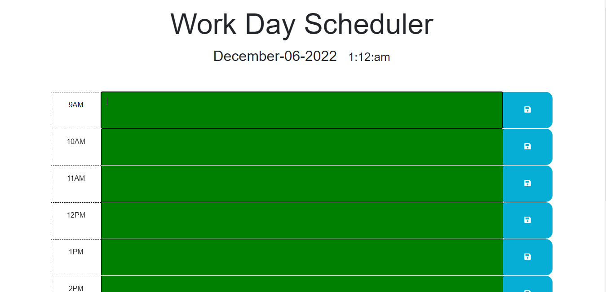

# Daily-planner

## Task

Create a simple calendar application that allows a user to save events for each hour of the day by modifying starter code. This app will run in the browser and feature dynamically updated HTML and CSS powered by jQuery.

You'll need to use the [Day.js](https://day.js.org/en/) library to work with date and time. Be sure to read the documentation carefully and concentrate on using Day.js in the browser.

## User Story

```md
AS AN employee with a busy schedule
I WANT to add important events to a daily planner
SO THAT I can manage my time effectively
```

## Acceptance Criteria

```md
GIVEN I am using a daily planner to create a schedule
WHEN I open the planner
THEN the current day is displayed at the top of the calendar
WHEN I scroll down
THEN I am presented with timeblocks for standard business hours
WHEN I view the timeblocks for that day
THEN each timeblock is color coded to indicate whether it is in the past, present, or future
WHEN I click into a timeblock
THEN I can enter an event
WHEN I click the save button for that timeblock
THEN the text for that event is saved in local storage
WHEN I refresh the page
THEN the saved events persist
```
## Work Done
```md
I used dayjs  to add a current date an time to the webpage.
I added a function to color code the timeblocks. 
Future timeblocks are green, the present hour will display as red, 
and past hours will be displayed as turquoise.
I added a function to give users the ability to save their tasks
to its corresponding time block. An option to clear local storage 
in each time slot will soon be available to the user as well.
For additional information, please refer to the notes within 
the files.
```




